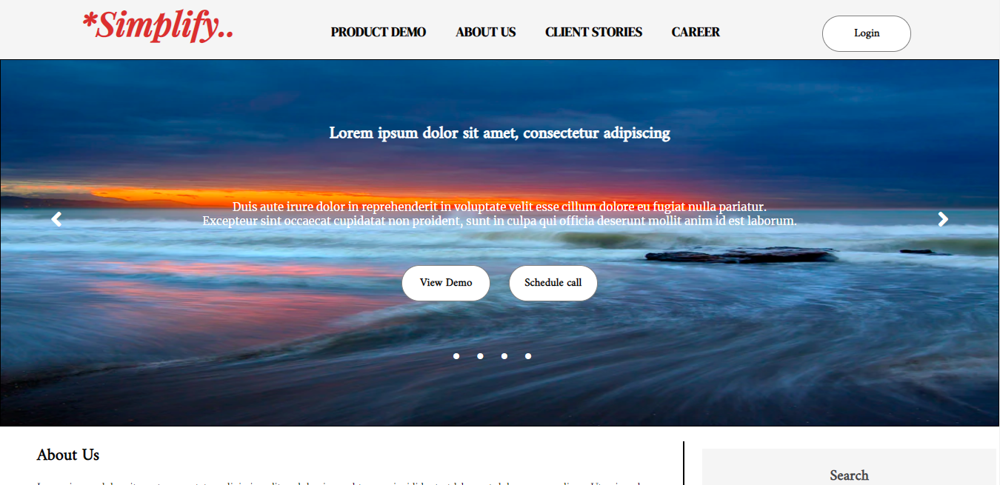
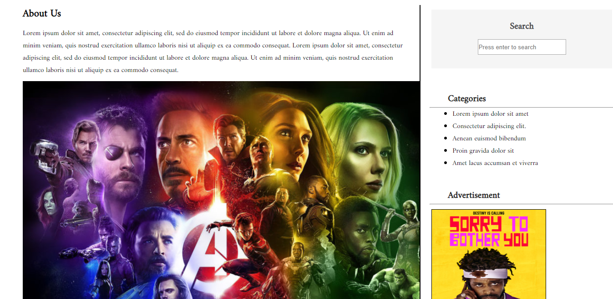
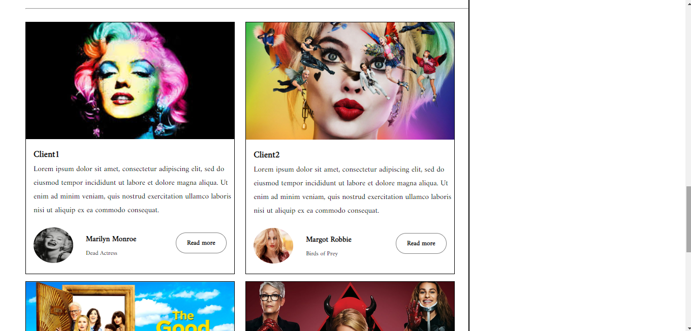
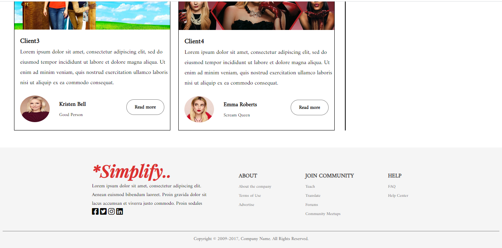
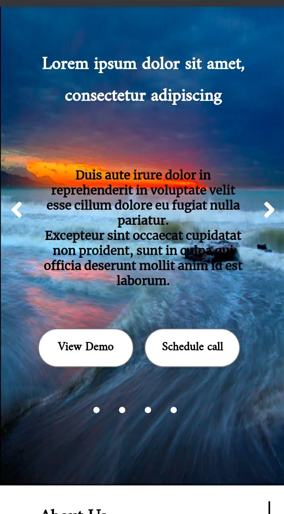
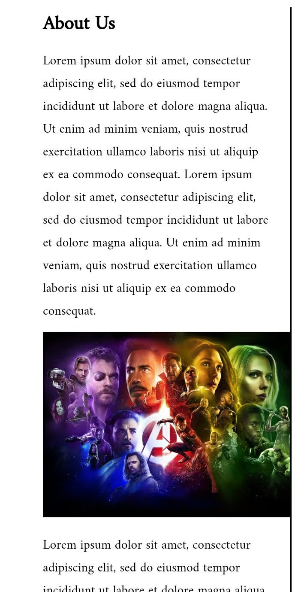
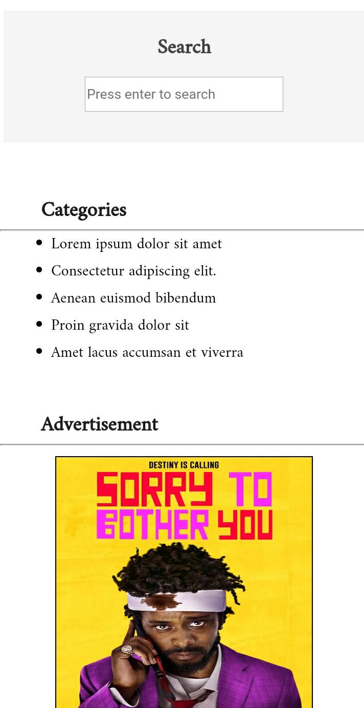
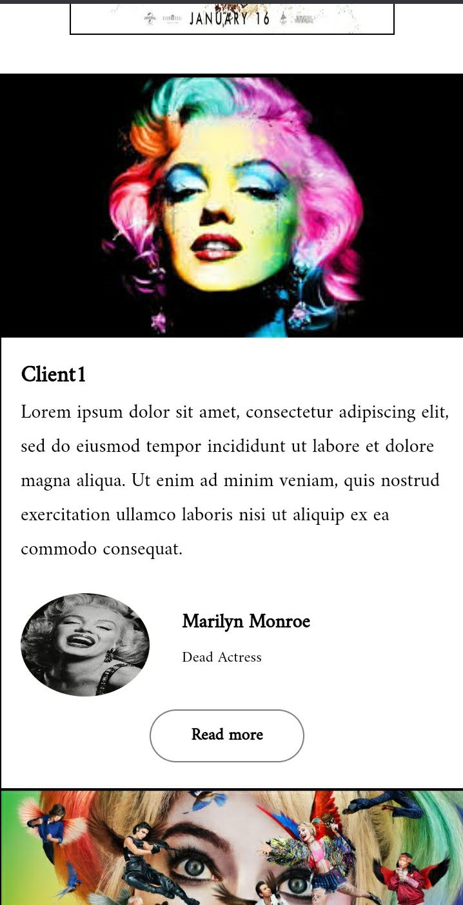
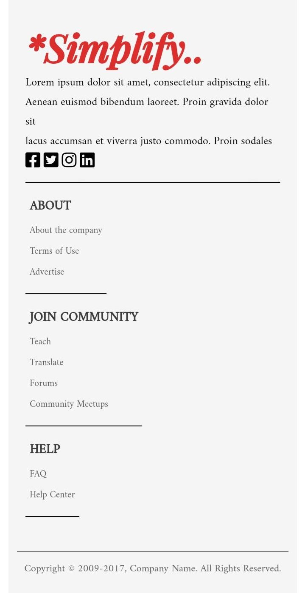

# simplify
A simple website.
In order to show-case my fundamental skills, I have not used any CSS/JS framework and I have coded things from scratch.

Check it out: https://shovaaa.github.io/simplify/

Laptop-view:

Image-1: Menu and Image slider section

Image-2: About Us, Search, Category and Advertisement section

Image-3: Client display section

Image-4: Footer section

Mobile view:

Image-1: Menu section

Image-2: Image slider section

Image-3: About Us Advertisement section

Image-4: Search, Category and Advertisement section

Image-5: Client display section

Image-6: Footer section
